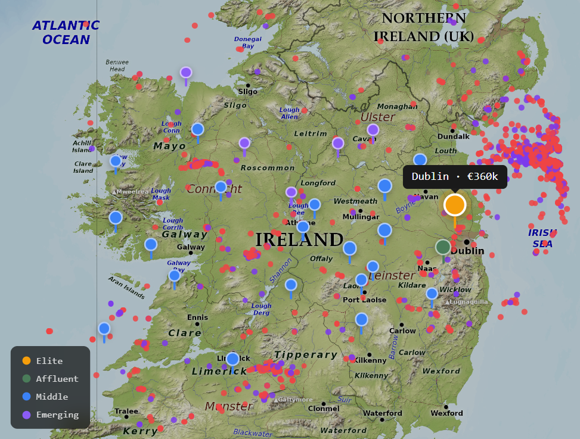

# Ireland Wealth Map

**Live site: [ireland-wealth-map.vercel.app](https://ireland-wealth-map.vercel.app)**

A full-stack data engineering and visualisation project analysing property wealth concentration across all 26 Irish counties using the national Property Price Register.



---

## What it does

786,907 residential property transactions from 2010 to 2024 processed through a custom Python pipeline to produce a composite Affluence Index for every Irish county and 827 Eircode districts. The dashboard lets you explore where money lives in Ireland — which counties are growing fastest, where inequality is highest, and which districts are emerging from a low baseline.

## Key findings

- Dublin ranks #1 with an Affluence Index of 72.2 (Tier 1 Elite), median sale price €360k
- Sligo is the fastest growing county at 11.6% CAGR over 5 years — faster than Dublin
- 15,588 properties sold above €1 million since 2010
- One Wicklow Eircode district (A65) recorded 30.3% annual price growth
- Wealth inequality (Gini coefficient) is highest in Kerry and Cork, not Dublin

## Stack

**Pipeline**
- Python, pandas, geopandas
- Nominatim OSM geocoding (11,124 luxury sales geocoded precisely)
- Snap-to-coast algorithm correcting 8,866 coastal geocoding errors
- Composite Affluence Index: median price (30%) + CAGR (25%) + luxury share (20%) + Gini (10%) + district score (15%)

**Dashboard**
- Next.js 14, TypeScript, Tailwind CSS
- Recharts for all data visualisations
- Real Ireland relief map with geographic county pins
- 50,000 point property heatmap colour-coded by price band
- Animated landing page (count-up sequence)
- Deployed on Vercel

**Data sources**
- Property Price Register (propertypriceregister.ie) — all residential sales since 2010
- Pobal HP Deprivation Index 2022
- Companies Registration Office (CRO)
- Register of Beneficial Owners (RBO)

## Project structure

```
ireland-wealth-map/
├── pipeline/
│   ├── 01_clean_ppr.py          # Clean and parse 786k PPR records
│   ├── 02_geocode.py            # Nominatim geocoding + county centroid fallback
│   ├── 04_affluence_index.py    # Build composite Affluence Index
│   ├── 05_export.py             # Export JSON for dashboard + snap-to-coast fix
│   └── 06_eircode_districts.py  # District-level surprise score analysis
├── dashboard/
│   ├── src/app/
│   │   ├── page.tsx             # Animated landing page
│   │   └── dashboard/page.tsx   # Full analytics dashboard
│   └── public/data/             # Pipeline output JSONs
└── data/
    └── processed/               # Intermediate parquet files
```

## Running locally

**Pipeline** (requires Python 3.11+)
```bash
pip install pandas geopandas pyarrow requests tqdm openpyxl
python pipeline/01_clean_ppr.py
python pipeline/02_geocode.py       # ~4.5 hours for luxury sales
python pipeline/04_affluence_index.py
python pipeline/05_export.py
cp output/*.json dashboard/public/data/
```

**Dashboard**
```bash
cd dashboard
npm install
npm run dev
```

## Data notes

The PPR-ALL.csv (~102MB) is excluded from the repository due to GitHub file size limits. Download it from [propertypriceregister.ie](https://www.propertypriceregister.ie) and place it at `data/raw/PPR-ALL.csv`.

Geocoding uses Nominatim OSM at 1 request/second (free, no API key required). Luxury sales (≥€1M) are geocoded precisely. All other transactions use county centroids with random jitter.

---

Built by Shiven Singh — Dublin, 2024
